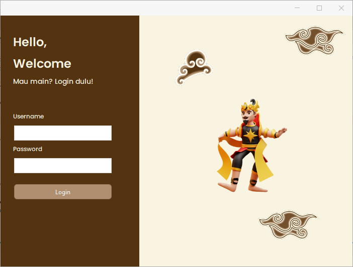
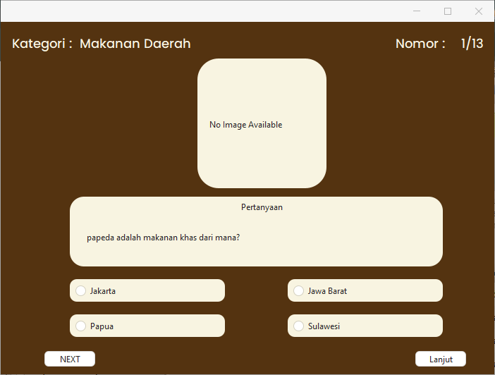
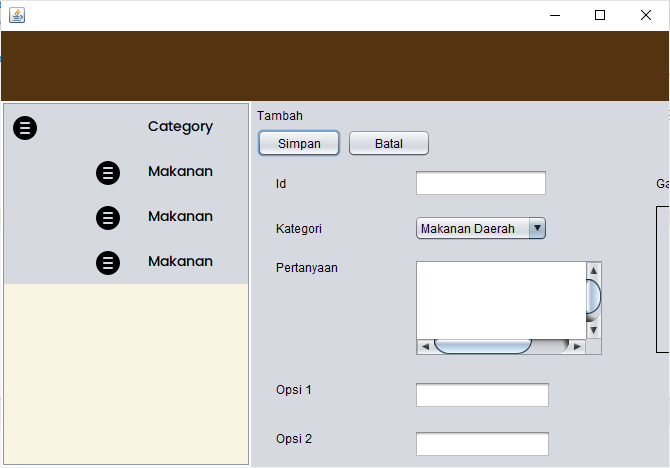

# Quiz Budaya
Quiz Budaya merupakan aplikasi pemberlajaran untuk anak-anak berbasis desktop yang bertujuan untuk lebih mengenalkan budaya Indonesia. tujuan dibuatnya aplikasi ini adalah developer ingin agar budaya Indonesia lebih gampang dikenal oleh anak-anak melalui permainan.

# 🚀 Fitur  
- ✅ Login dan register akun  
- ✅ Memilih Kategori budaya seperti pakaian adat, rumah adat, makanan khas dan lain lain.
- ✅ Menyimpan Skor setiap pemain
- ✅ Login sebagai admin dan bisa mengubah pertanyaan maupun ingin menambah
  
# 🛠️ Teknologi yang Digunakan  
Project ini dibuat menggunakan tools dan bahasa:  
- [✔️] Java
- [✔️] Mysql

# 📦 Instalasi  
1. Clone repositori ini:  
   "git clone https://github.com/lintingggg/Project_Akhir_Pemvis-3C.git"
2. Import databate nya.
3. Gass Runn

# Overview
1. Login

2. Beranda

3. Quiz

   

4. Admin

   

👤 Penulis
Muhammad Iqbal Faza – [GitHub](https://github.com/lintingggg) | [LinkedIn](https://www.linkedin.com/in/muhammad-iqbal-faza)
